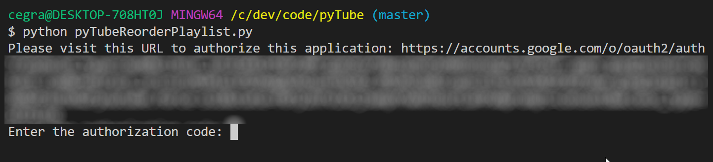

# pyTube #

pyTube exists to make managing our large content libraries on YouTube and Dailymotion a bit easier. It's also an excuse for coding, learning and doing boring stuff quickly.


## What's in the project ##

### YouTube ###

* [reorder_playlist.py](#reorder_playlist) takes a list of YouTube Playlist IDs, gathers the videos in each playlist and reorders them according to their episode number. This is highly customized to our internal needs, but with minor modifications should work with any Playlist you own.

### Dailymotion ###

* [dm_playlists.py](#dm_playlists) takes a list of Dailymotion Playlist IDs, gathers the videos in each playlist and reorders them according to their episode number. This is highly customized to our internal needs, but with minor modifications should work with any Playlist you own. After reordering the playlist, it writes out the episodes' id, order, title and description to a local .csv file.

### These have been moved to the legacy folder

* [pyTubePlaylist](#pytubeplaylist) lets you download all the video metadata for a YouTube playlist.
* [pyTubeReorderPlaylist](#pytubereorderplaylist) lets you take the metadata downloaded by pyTubePlaylist and (after some minor editing in Excel or Google Sheets) re-order the videos in the playlist by their episode number. This is particularly useful when you have a playlist with 150 episodes out of order.
* [pyTube](#pytube2) lets you download basic stats for a list of channels.

## Getting Started ##

### Clone this repository: ###

```bash
git clone https://github.com/cgranier/pyTube.git
```

### Install dependencies: ###

* Install the Google APIs Client Library for Python

```bash
pip install --upgrade google-api-python-client
pip install --upgrade google-auth google-auth-oauthlib google-auth-httplib2
```

* Install the Dailymotion [libraries](https://github.com/dailymotion/dailymotion-sdk-python):

```bash
pip install dailymotion
```

* Install additional libraries

```bash
pip install pandas
```

### Setup YouTube APIs ###

If you're on my team, contact me for API access or CMS credentials if neeeded. Otherwise, you will need to create a Project on Google Cloud Platform and add the YouTube Data API V3.

The project doesn't need an API key anymore, as it uses OAuth to authenticate you with YouTube. You will need a YouTube account with permissions to manage the channel with the Playlist. This could be the channel owner's account or a YouTube CMS account (MCN Network) with admin permissions to act on behalf of channels in the network.

1. Create an OAuth token for your project in Google Cloud Platform, so that you can authorize modification of your videos (needed to reorder a playlist or access private videos):

* Go to the [APIs dashboard](https://console.cloud.google.com/apis/dashboard) for your project.

* Go to the [Credentials page](https://console.cloud.google.com/apis/credentials) and select Create credentials | OAuth client ID.

* Select the application type Other, give it a memorable name, and click the Create button.

* Click the file_download (Download JSON) button to the right of the client ID.

* Move the downloaded file to your working directory and rename it client_secret.json.

2. Create a _config.py_ file and add your YouTube API credentials:

```
api_key = '[YOUR API KEY]'
content_owner = '[YOUR CONTENT OWNER ID]' (This is for MCN/CMS accounts only)
```

3. Add your Dailymotion API credentials to _config.py_:

```
CLIENT_ID = '[YOUR API KEY]'
CLIENT_SECRET = '[YOUR API SECRET]'
USERNAME = '[YOUR USERNAME]'
PASSWORD = '[YOUR PASSWORD]'
REDIRECT_URI = '[YOUR REDIRECT URI]'
BASE_URL = 'https://api.dailymotion.com'
OAUTH_AUTHORIZE_URL = 'https://www.dailymotion.com/oauth/authorize'
OAUTH_TOKEN_URL = 'https://api.dailymotion.com/oauth/token'
```

## reorder_playlist ##

### Description ###

reorder_playlist allows you to download a list of videos within a playlist and modify their order within the playlist.

It currently downloads the following data, but more data is available:

* playlist_item_id: the video's ID within the playlist. This is different than the video's ID and is necessary for updating the video within the playlist.
* video_id: the video's ID on YouTube.
* video_title: the video's title.
* video_position: the video's position within the playlist.

### Arguments ###

For reorder_playlist you must provide a list of playlist ids:

```python
PLAYLISTS = ['PLM21IsezPrtpSFaeQR7nvEft7S_4vsE8S',
             'PLM21IsezPrtqf4Bh6H1M3zI4zNO4KIGbX']
```

### Run the code ###

```bash
python reorder_playlist.py
```

### Functions ###

1. get_authenticated_service

Uses the Google API Client Libraries to authorize the script to modify your channels. You will see a message on the command line with a URL for OAuth authentication. Copy the URL into your browser (ideally one where you've already logged in into YouTube with the account that owns the playlist you wish to reorder), follow the instructions to authorize your project to manage the YouTube account, and copy the authorization code.



Paste the authentication code into your terminal and continue.

2. get_playlist_videos

Uses youtube.playlistItems().list to request a list of all videos in a playlist, paging through the playlist until all videos have been processed (YouTube limits results to 50 per page). Returns a JSON object with all the video metadata.

3. get_video_list

Iterates through the video metadata collected by _get_playlist_videos_ and creates a dictionary with the data we need for reordering. Uses a regex to extract the episode number from the video title.

The resulting dictionary is converted into a Pandas dataframe and reordered by episode number.

4. reorder_playlist_videos

Calls youtube.playlistItems().update with new position data for each episode. Episodes need to be ordered from first to last in order to keep the proper position within the playlist.

**Note:** By default, YouTube limits API queries to 10,000 quota points per day. Reordering one video uses up 53 quota points right now, so you will be limited to around 180 videos per day.

## dm_playlists ##

### Description ###

dm_playlists allows you to download a list of videos within a playlist and modify their order within the playlist.

It currently downloads the following data, but more data is available:

* video_id: the video's ID on Dailymotion.
* video_title: the video's title.
* video_url: the video's url in Dailymotion.
* video_description: the video's metadata description.

### Arguments ###

For dm_playlists you must provide a list of playlist ids:

```python
DAILYMOTION = ['playlist_id_1',...,'playlist_id_n']
```

### Run the code ###

```bash
python dm_playlists.py
```

### Functions ###

1. get_playlist_videos

Uses the Dailymotion API to GET a list of videos belonging to a playlist. It paginates through the list until no more videos are available and returns the results in playlist_videos[].

2. get_video_list

Goes through playlist_videos and uses a regex to determine the relevant episode number for every video in the list. Stores the new list with episode numbers in video_list.

NOTE: We could (should?) probably combine 1. and 2. into a single function.

3. reorder_videos

Uses the Dailymotion API to POST an ordered list of videos. The playlist will have the videos in the same order as the ids posted. Uses a Pandas dataframe created from video_list and sorted by episode. The video ids (now in order) are posted via the API, thus reordering the playlists.

4. create_ordered_csv

Writes the dataframe out to a csv file, named according to the playlist id. Currently writes it out to the active directory.

## Contribution guidelines ##

Please take a look at our contributing [guidelines](CONTRIBUTING.md) if you're interested in helping!

## Pending Features ##

* Front end
* Edit video metadata
* Access metadata from a database
* Add comments to videos
* Download all reports every month for archiving


![1x.engineer](https://img.shields.io/github/stars/cutenode/1x.engineer.svg?color=purple&label=1x%20Engineers&logo=image%2Fpng%3Bbase64%2CiVBORw0KGgoAAAANSUhEUgAAADAAAAAwCAYAAABXAvmHAAADAElEQVRoQ%2B1YPZMNQRQ9RyYiUCVkI0J%2BASUi4xfYzYjsVsmXX2BFZFauigyJ4hcQEtkNVQmoEjvqqh7VM6%2B%2FZ%2BapqXodvtdz%2B56%2B59zT3cTCBxeePzYA%2FncFNxUoqYCkEwC2AbwjeVTyTemctVRA0iUAH11SxwBekLxfmmRq3roA3AHwxEvkLcnrSwJwCOC2l%2FBDkg%2BWBOAzgAtewjdIvlkEAElnAHwDYEK28RvAWZLflwLAuP7aS%2FYLyYtTJG8xZhexJOP6vpfwc5LWUicZ6wDwHsAVL9u7JJ9Okv2YCki6SfJVKhFnYL8AnPTmXSb5yf%2BuJFZsnaYKSHoEYBfAIcmdWPCBgdk0E64J2IT8d0h65lz6gORebWWqAEg6DeAlgKveQjskrc%2BvDElJA5NkWjAA3TC63SL5oxRIMQC3m5b8%2BUHwn%2FZbaFFJUQNzm2HnolODePabgejRbBSF3E4ZbawC%2FrBzjWkhuJikpIG5TTEdnRvEtQrsxSrrz81WwOP7cBM%2BuOSD5S41MFcJA%2BF3qm6trC6iACJ87wI%2FJmkijg5JVQYm6QDAvUDApC6CADJ83y0pbYuBOaoakGJdrACwnuw6QxXfhzsnqcnAMrqwjtfznhCAr4FOk%2BR7IHk7uGUNLMa%2FhC6OSG4lRSzJ2tiwK1T15xIDy%2Bgn5Df2yTHJXhuPUcj6dzEPAxVovoFl9LedpZAlM7Y%2Fpwwss%2FPmzFV%2Bk2ujTf05Z2AhEK1%2BU2JkVf251MA6EGP9JgvAUcpKW9SfawxsCr8pAlCgi63uMFdqYG7nrWWP8ptiAA6ELTbURe84XWNggeN0ld9YTlUAPN52uujdb0tvYL6IvY6VPV%2BFxN8EwFVj5UrZamBrv1ImjgDNBpbyh9R%2FzRWI9PLZnhBjIKYGMNsT4uwAag2slTLD7yarQI2BTZV8cxuN8H%2FWJ8R1UKjpBja2GlNSyMzNrqPdZWjlCXFsspMaWcIL7MZ0zT07%2FntCnCP5STUwV4K5uJNRKLfQXP9vAMy1s6VxF1%2BBPxWSokDSvlDHAAAAAElFTkSuQmCC&style=for-the-badge&link=https://1x.engineer&link=https://github.com/cutenode/1x.engineer/stargazers)

